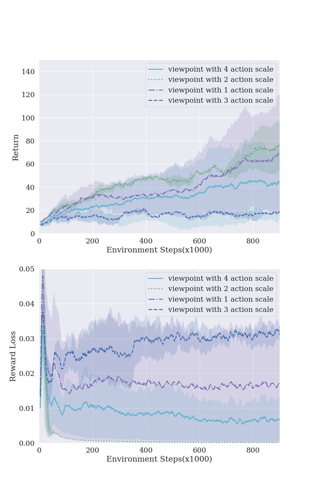
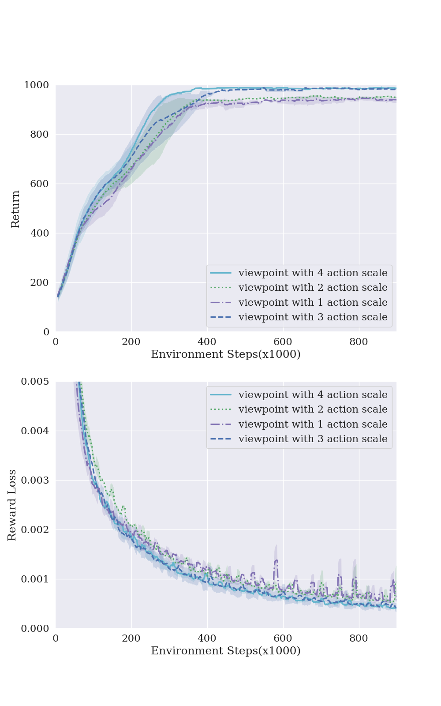
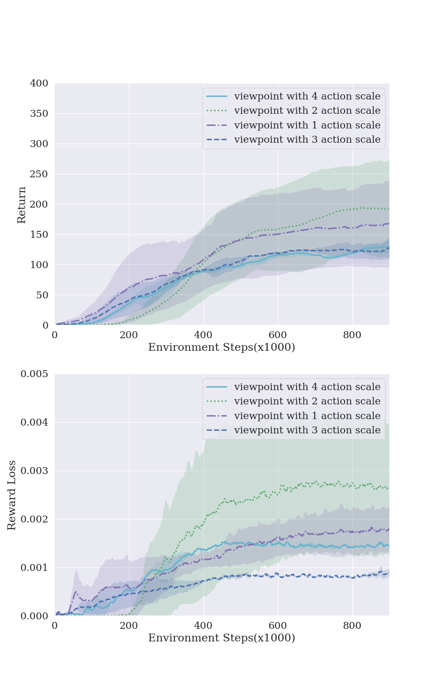
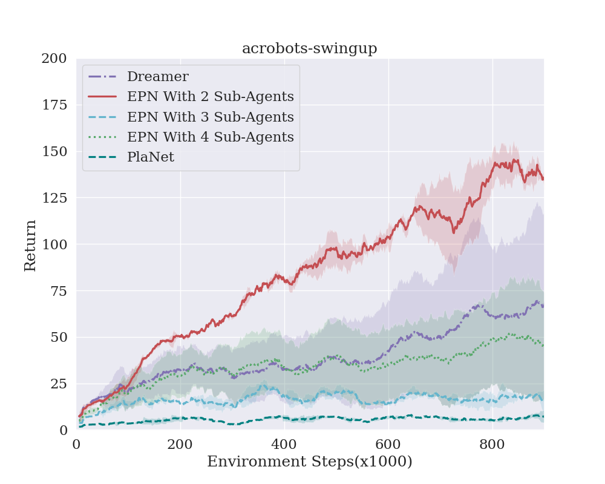
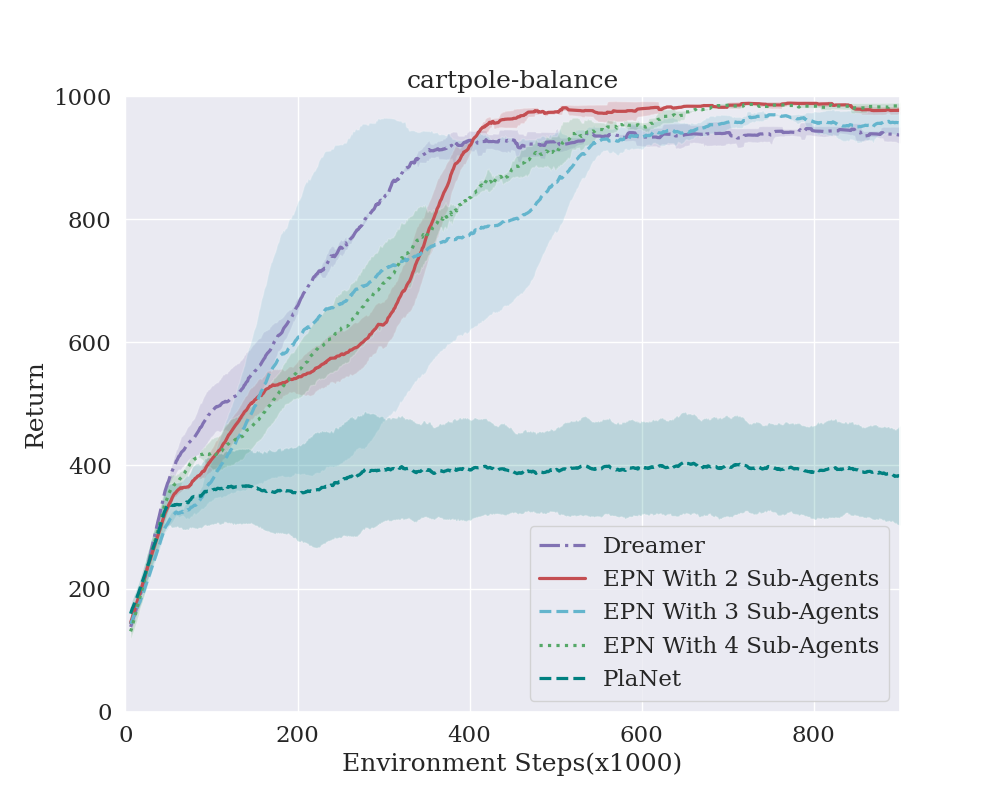
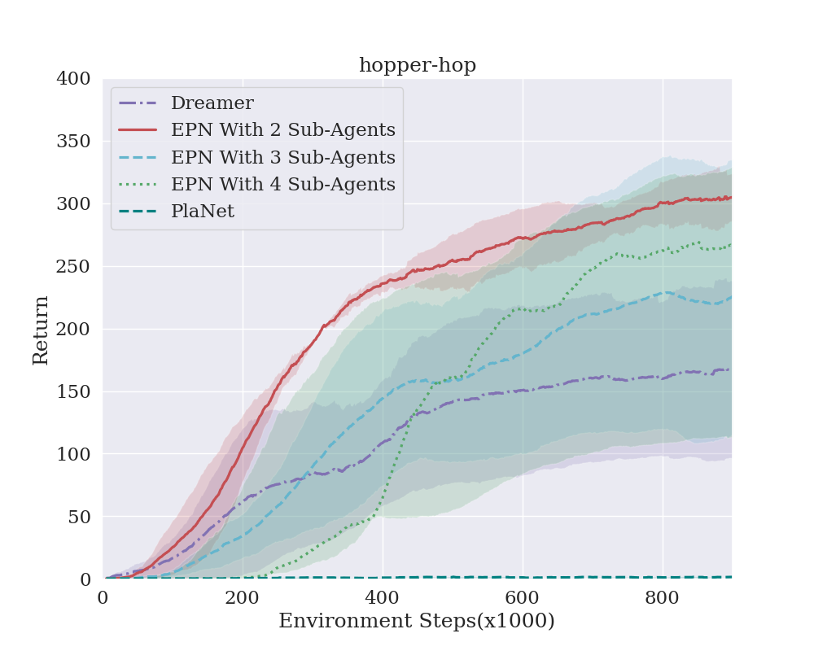

<div align="center">

# Erlang Planning Network &nbsp;·&nbsp; Multi-Step Pruning Policy

**Iterative, multi-perspective model-based reinforcement learning** &nbsp;—&nbsp; the official implementation of two published works on world-model planning.

<p>
  <a href="https://www.sciencedirect.com/science/article/abs/pii/S0020025524012751"></a>
  <a href="https://www.sciencedirect.com/science/article/abs/pii/S0031320322001492"></a>
  
  
  
</p>

</div>

---

## ✨ Highlights

This repository unifies two papers that share a common philosophy — **planning is more robust when multiple perspectives on the world model are explored in parallel** — into a single, easy-to-run codebase.

| Project | Venue | What it proposes |
|---|---|---|
| **EPN** &nbsp;— Erlang Planning Network | *Pattern Recognition*, 2022 | A **bi-level** architecture: one upper-level agent coordinates several **multi-scale parallel sub-agents**, trained iteratively to broaden the representation of the world model and escape local optima. |
| **MSPP** &nbsp;— Multi-Step Pruning Policy | *Information Sciences*, 2024 | Compresses redundant action/state space with **multiple parallel pruning policies** and fuses them through a **cross-entropy** integrator. Includes a tabular convergence proof of the pruning-policy theory. |

Both methods are model-based, target visual continuous control, and are compared against the **Dreamer / PlaNet** family.

---

## 🧠 Why this matters

Classical model-based RL is brittle in two ways:

1. **World-model bias** — a single learned dynamics model is treated as ground truth.
2. **Singular-policy bias** — one policy is rolled out inside that model.

EPN and MSPP attack the second source of bias. Instead of trusting one policy, they roll out **a population of policies with different scales / pruning views**, then aggregate. The result is more reliable planning inside the same imperfect world model.

📄 Full paper PDF is included in the repo: [`Understanding world models through multi-step pruning policy via reinforcement learning.pdf`](./Understanding%20world%20models%20through%20multi-step%20pruning%20policy%20via%20reinforcement%20learning.pdf)

---

## 📦 Installation

Verified on Python **3.10 – 3.12** with modern PyTorch (≥ 2.x). The exact dependency set lives in [`requirements.txt`](./requirements.txt).

```bash
git clone https://github.com/tinyzqh/MSPP.git
cd MSPP

# 1. fresh environment (conda or venv — pick one)
conda create -n mspp python=3.10 -y && conda activate mspp
#   or:   python -m venv .venv && source .venv/bin/activate

# 2. core training stack
pip install -r requirements.txt

# 3. (optional) extras only needed for utils_plot.py post-hoc plotting
pip install -r requirements-plot.txt
```

### What's in `requirements.txt`

| Package | Purpose |
|---|---|
| `torch`, `torchvision` | Models, multiprocessing, video grid writer |
| `numpy`, `opencv-python` | Numerics + image preprocessing |
| `tensorboardX`, `tqdm`, `plotly` | Logging, progress bars, HTML loss plots |
| `dm_control` | DeepMind Control Suite envs (pulls in `mujoco`) |
| `gym` / `gymnasium` *(optional)* | Gym envs listed in `env.py` — commented out by default |

### GPU / CPU

- **GPU**: any CUDA-capable PyTorch build works. Multi-GPU is auto-enabled via `torch.nn.DataParallel` when more than one CUDA device is visible.
- **CPU only**: pass `--disable-cuda`. Training works but is orders of magnitude slower; useful for smoke-tests.

### Headless servers (no X11)

```bash
export MUJOCO_GL=osmesa   # or 'egl' on machines with EGL
python asynchronous_main.py --symbolic-env ...
```

DM Control will otherwise try to open a GLFW window and emit `GLFWError: DISPLAY environment variable is missing`.

### Quick smoke-test

After install, this should finish in well under a minute on CPU and confirm everything is wired up:

```bash
python asynchronous_main.py \
  --algo dreamer --env cartpole-balance --symbolic-env \
  --episodes 3 --seed-episodes 1 --collect-interval 2 \
  --batch-size 2 --chunk-size 10 --max-episode-length 50 \
  --disable-cuda --test-interval 999
```

You should see two `training loop` + `Data collection` blocks and `EXIT 0`, and `results/.../models_*.pth` written to disk.

---

## 🚀 Quick Start

The entry point is `asynchronous_main.py`. Algorithms are selected with `--algo`:

| `--algo` | Description |
|---|---|
| `dreamer` | Dreamer baseline (single policy) |
| `planet` | PlaNet baseline |
| `p2p` | Plan-to-plan variant |
| `actor_pool_1` | Pool of actors (EPN ablation) |
| `aap` | **EPN / MSPP** — multi-scale parallel sub-agents (default) |

### Train the multi-perspective agent (MSPP / EPN)

```bash
python asynchronous_main.py \
  --algo aap \
  --env acrobot-swingup \
  --pool_len 3 \
  --top_planning-horizon 8 \
  --seed 5
```

### Train a Dreamer baseline for comparison

```bash
python asynchronous_main.py --algo dreamer --env cartpole-balance --seed 5
```

### Resume from a checkpoint

```bash
python asynchronous_main.py --algo aap --env acrobot-swingup \
  --models results/.../models_500.pth
```

### Evaluate only

```bash
python asynchronous_main.py --test --models path/to/checkpoint.pth --env hopper-hop
```

### Outputs

Each run writes to `results/{env}_seed_{seed}_{algo}_..._{top_planning_horizon}/`:

| Path | Content |
|---|---|
| `models_{episode}.pth` | World model + per-algorithm state dicts + optimizer + metrics — resumable |
| `train_rewards_episode.txt` | Per-episode return |
| `{observation,reward,kl}_loss_episode.txt` | World-model loss curves |
| `{actor,value}_loss{i}_episode.txt` | Per sub-actor losses (aap / p2p) |
| `experience.pth` | Replay buffer dump (only if `--checkpoint-experience`) |
| `{env}_{id}_log/` | TensorBoard event files |

The `results/` tree is `.gitignored`.

---

## 📊 Results

### Erlang Planning Network — performance across views

Multiple parallel sub-agents reach high returns where a single-view planner stalls.

<div align="center">
  
  
  
</div>

### Erlang Planning Network vs. Dreamer

Head-to-head comparison against Dreamer, the state-of-the-art model-based baseline at the time.

<div align="center">
  
  
  
</div>

### MSPP

Detailed curves, ablations, and the tabular convergence analysis are in the [Information Sciences paper](https://www.sciencedirect.com/science/article/abs/pii/S0020025524012751) and the bundled PDF.

---

## 🗂 Project Structure

```
MSPP/
├── algorithms/
│   ├── dreamer.py                      # Dreamer baseline
│   ├── planet.py                       # PlaNet baseline
│   ├── plan_to_plan.py                 # p2p variant
│   ├── actor_pool_1.py                 # Actor-pool ablation
│   └── asynchronous_actor_planet.py    # EPN / MSPP — multi-scale parallel sub-agents
├── asynchronous_main.py                # Entry point — orchestrates training
├── asynchronous_actor.py               # Async actor worker
├── asynchronous_init_sample.py         # Seed-episode collection
├── planner.py                          # CEM planner
├── models.py                           # Transition / Observation / Reward / Encoder / Actor / Value
├── memory.py                           # Experience replay
├── env.py                              # DM Control + Gym wrappers
├── parameter.py                        # All CLI hyper-parameters
├── utils.py / utils_plot.py            # Helpers & plotting
└── figures/                            # Result plots used above
```

---

## ⚙️ Key Hyper-parameters

The most relevant flags (see `parameter.py` for the full list):

| Flag | Default | Meaning |
|---|---:|---|
| `--env` | `acrobot-swingup` | DM Control / Gym task |
| `--algo` | `aap` | Algorithm selector (see table above) |
| `--pool_len` | `3` | Number of parallel sub-actors (EPN/MSPP) |
| `--top_planning-horizon` | `8` | Upper-level planning horizon |
| `--planning-horizon` | `15` | Sub-agent planning horizon |
| `--candidates` | `1200` | CEM candidate trajectories |
| `--top-candidates` | `100` | CEM elite set size |
| `--batch-size` | `12` | Training batch size |
| `--episodes` | `1000` | Total training episodes |
| `--seed-episodes` | `5` | Random episodes used to warm-start the buffer |
| `--action-scale` | `1` | Action-repeat scale used inside `imagine_ahead` (≥1) |
| `--checkpoint-interval` | `50` | Episodes between `models_*.pth` snapshots |
| `--MultiGPU` | `True` | Auto multi-GPU via `DataParallel` |
| `--disable-cuda` | flag | Force CPU even if a GPU is visible |

---

## 🧰 Maintenance Notes

This fork has been audited and patched against the original release. The most user-visible changes:

- **Checkpoints are now actually saved.** The original repo had `torch.save(model_state, ...)` commented out in `save_model_data`, so multi-day runs left no resumable artefact. Resolved — each `checkpoint_interval` writes `models_{episode}.pth` containing the world model, per-algorithm actor/value pools, optimizer state, and metrics.
- **Inter-process tensor transfer no longer hits disk.** Previously every collect step wrote `actor_states.pt` + `actor_beliefs.pt` and the actor workers `torch.load`ed them back; replaced with direct pipe-based transfer (auto-IPC via PyTorch multiprocessing).
- **Seed-episode workers now use distinct seeds** — the original passed the same `args.seed` to every worker, so the "S random seed episodes" were S identical trajectories.
- **`data_collection` now uses exploration noise** (`explore=True`) — the original silently ran the deterministic policy, hurting buffer diversity.
- **Actor workers shut down cleanly** via a sentinel on the pipe — the original orphaned them at process exit (visible as `EOFError` tracebacks on shutdown).
- **CEM std-dev is clamped to `1e-6`** so collapsed elites don't produce `Normal(scale=0)` and get rejected by modern PyTorch.
- **`--action-scale` defaults to `1`** (was `-1`, which made `imagine_ahead` pop from an empty list and crash on the dreamer path).
- **CPU-only path works** — several `.cuda()` calls inside `MPCPlanner` are now `.to(args.device)`.
- **Misc**: `TanhBijector` no longer instantiates the abstract `constraints.Constraint`; `is not ''` → `!= ''`; tqdm `total`/`initial` are correct; per-step accounting uses `t * action_repeat` consistently; cuDNN determinism is enabled by default.

See git history for the precise diffs.

### Known limitations

- The repo was originally engineered for multi-GPU; the `MultiGPU` chunk/concat trick inside `Plan.upper_transition_model` has not been re-tested under the modern stack — keep an eye on it if you train on multiple cards.
- `gym` env names are still pinned to a `Pendulum-v0`-era list — if you use Gym envs, update `env.py` to whatever your installed `gym`/`gymnasium` exposes.

---

## 📚 Citation

If this code or these ideas helped your research, please cite both papers.

```bibtex
@article{he2024understanding,
  title   = {Understanding World Models through Multi-Step Pruning Policy via Reinforcement Learning},
  author  = {He, Zhiqiang and Qiu, Wen and Zhao, Wei and Shao, Xun and Liu, Zhi},
  journal = {Information Sciences},
  pages   = {121361},
  year    = {2024},
  publisher = {Elsevier}
}

@article{wang2022erlang,
  title   = {Erlang planning network: An iterative model-based reinforcement learning with multi-perspective},
  author  = {Wang, Jiao and Zhang, Lemin and He, Zhiqiang and Zhu, Can and Zhao, Zihui},
  journal = {Pattern Recognition},
  volume  = {128},
  pages   = {108668},
  year    = {2022},
  publisher = {Elsevier}
}
```

---

## 🙏 Acknowledgements

Built on top of the open-source [PlaNet](https://arxiv.org/abs/1811.04551) and [Dreamer](https://arxiv.org/abs/1912.01603) line of work, and the [DeepMind Control Suite](https://github.com/deepmind/dm_control).

## 📬 Contact

Questions, issues, and PRs are welcome. For paper-related discussion, please open a GitHub issue or reach the corresponding author through the publication pages linked above.
